<div align="center">

[🇬🇧 EN](README.md) · [🇫🇷 FR](README.fr.md) · [🇷🇺 RU](README.ru.md) · [🇨🇳 中文](README.zh.md)




</div>

<br>

```
guest@cypher:~$ whoami
```

développeur qui construit des systèmes IA et de l'infrastructure SaaS. pas de CV, pas de jargon LinkedIn — juste du code livré.

```
guest@cypher:~$ cat identity.txt
```

- **rôle**    → développeur full-stack, AI-first
- **focus**   → agents autonomes, systèmes backend, outils SaaS
- **méthode** → construire en silence, livrer sans bruit
- **statut**  → `[EN LIGNE]`

<br>

## `> stack --list`

<div align="center">


</div>

```
ia / agents   orchestration llm · pipelines agentiques · systèmes d'automatisation
backend       apis rest / graphql · bases de données sql & nosql
outils        scripting shell · intégration api · rétro-ingénierie
```

<br>

## `> manifesto.txt`

```
aucune permission demandée. pas de gardiens.
construire l'outil d'abord, expliquer ensuite.
la vie privée est un défaut, pas une option.
le code ne ment pas — tout le reste peut mentir.
```

<br>

## `> ls ./projects`

```
drwx------  [CENSURÉ]         accès refusé
drwx------  chargement...     en cours
-rw-------  bientot.log       chiffré
```

<br>

## `> contact --secure`

<div align="center">

[](https://github.com/cypherxdev77)

</div>

<br>

<div align="center">
<sub>connexion chiffrée · session non enregistrée</sub>
</div>
