<a id="top"></a>
<div align="center">




<br>

<a href="#en"></a>
<a href="#fr"></a>
<a href="#ru"></a>
<a href="#zh"></a>

<sub><i>no JS runs on GitHub profiles — click a flag, the page jumps straight there, same tab</i></sub>

<br><br>


</div>

<br>

<a id="en"></a>
<div align="center">


</div>

```
guest@cypher:~$ whoami
```

developer building AI systems and SaaS infrastructure. no résumé, no LinkedIn buzzwords — just shipped code.

```
guest@cypher:~$ cat identity.txt
```

- **role**   → full-stack developer, AI-first
- **focus**  → autonomous agents, backend systems, SaaS tooling
- **method** → build in silence, ship without noise
- **status** → `[ONLINE]`

<br>

## `> stack --list`

<div align="center">


</div>

```
ai / agents   llm orchestration · agentic pipelines · automation systems
backend       rest / graphql apis · sql & nosql databases
tools         shell scripting · api integration · reverse engineering
```

<br>

## `> philosophy.txt`

```
freedom      → no hierarchy asked for permission to exist. none granted back.
              decentralize everything that can be decentralized.
              the fewer gatekeepers between an idea and its execution, the better.

privacy      → anonymity is not guilt. it's the default state before surveillance.
              encrypt first, explain never.
              what isn't logged can't be used against you.

action       → talk is cheap, shipped code is not.
              judged on what exists, not on what's announced.
              build the thing — let it speak for itself.
```

<br>

## `> manifesto.txt`

```
no permission asked. no gatekeepers.
build the tool first, explain it later.
privacy is a default, not a feature.
code doesn't lie — everything else might.
```

<br>

## `> ls ./projects`

```
drwx------  [REDACTED]        access denied
drwx------  loading...        in progress
-rw-------  more_soon.log     encrypted
```

<br>

## `> contact --secure`

<div align="center">

[](https://github.com/cypherxdev77)

</div>

<br>

<div align="center">
<sub>connection encrypted · session logged nowhere</sub>

[↑ back to top](#top)
</div>

<br>

<a id="fr"></a>
<div align="center">


**🇫🇷 Français**

</div>

```
guest@cypher:~$ whoami
```

développeur qui construit des systèmes IA et de l'infrastructure SaaS. pas de CV, pas de jargon LinkedIn — juste du code livré.

```
guest@cypher:~$ cat identity.txt
```

- **rôle**    → développeur full-stack, AI-first
- **focus**   → agents autonomes, systèmes backend, outils SaaS
- **méthode** → construire en silence, livrer sans bruit
- **statut**  → `[EN LIGNE]`

```
ia / agents   orchestration llm · pipelines agentiques · systèmes d'automatisation
backend       apis rest / graphql · bases de données sql & nosql
outils        scripting shell · intégration api · rétro-ingénierie
```

```
guest@cypher:~$ cat philosophy.txt
```

```
liberté      → aucune hiérarchie n'a demandé la permission d'exister. aucune ne l'obtient de moi.
              décentraliser tout ce qui peut l'être.
              moins il y a de gardiens entre une idée et son exécution, mieux c'est.

vie privée   → l'anonymat n'est pas une culpabilité. c'est l'état par défaut avant la surveillance.
              chiffrer d'abord, expliquer jamais.
              ce qui n'est pas enregistré ne peut pas être retenu contre toi.

action       → parler ne coûte rien, livrer du code si.
              on est jugé sur ce qui existe, pas sur ce qui est annoncé.
              construire la chose — la laisser parler d'elle-même.
```

```
aucune permission demandée. pas de gardiens.
construire l'outil d'abord, expliquer ensuite.
la vie privée est un défaut, pas une option.
le code ne ment pas — tout le reste peut mentir.
```

```
drwx------  [CENSURÉ]         accès refusé
drwx------  chargement...     en cours
-rw-------  bientot.log       chiffré
```

<div align="center">
<sub>connexion chiffrée · session non enregistrée</sub>

[↑ retour en haut](#top)
</div>

<br>

<a id="ru"></a>
<div align="center">


**🇷🇺 Русский**

</div>

```
guest@cypher:~$ whoami
```

разработчик, создающий AI-системы и SaaS-инфраструктуру. без резюме, без баззвордов из LinkedIn — только рабочий код.

```
guest@cypher:~$ cat identity.txt
```

- **роль**    → full-stack разработчик, AI-first
- **фокус**   → автономные агенты, backend-системы, SaaS-инструменты
- **метод**   → строить в тишине, поставлять без шума
- **статус**  → `[ОНЛАЙН]`

```
ai / агенты   оркестрация llm · агентные пайплайны · системы автоматизации
backend       rest / graphql api · sql и nosql базы данных
инструменты   shell-скрипты · интеграция api · реверс-инжиниринг
```

```
guest@cypher:~$ cat philosophy.txt
```

```
свобода       → ни одна иерархия не спрашивала разрешения существовать. я его не даю в ответ.
               децентрализовать всё, что можно децентрализовать.
               чем меньше привратников между идеей и её исполнением — тем лучше.

приватность   → анонимность — не вина. это состояние по умолчанию до слежки.
               сначала шифровать, потом никогда не объяснять.
               то, что не залогировано, не может быть использовано против тебя.

действие      → слова ничего не стоят, а поставленный код — стоит.
               судят по тому, что существует, а не по тому, что анонсировано.
               строй вещь — пусть она говорит сама за себя.
```

```
разрешения не спрашиваю. без привратников.
сначала строю инструмент, объясняю потом.
приватность — это стандарт, а не опция.
код не врёт — всё остальное может.
```

```
drwx------  [СКРЫТО]          доступ запрещён
drwx------  загрузка...       в процессе
-rw-------  скоро.log         зашифровано
```

<div align="center">
<sub>соединение зашифровано · сессия нигде не логируется</sub>

[↑ наверх](#top)
</div>

<br>

<a id="zh"></a>
<div align="center">


**🇨🇳 中文**

</div>

```
guest@cypher:~$ whoami
```

开发AI系统与SaaS基础设施的工程师。没有简历,没有LinkedIn式的行话——只有已交付的代码。

```
guest@cypher:~$ cat identity.txt
```

- **角色** → 全栈开发者, AI优先
- **专注** → 自主智能体, 后端系统, SaaS工具
- **方法** → 默默构建, 无声交付
- **状态** → `[在线]`

```
ai / 智能体    llm编排 · 智能体流水线 · 自动化系统
后端           rest / graphql api · sql与nosql数据库
工具           shell脚本 · api集成 · 逆向工程
```

```
guest@cypher:~$ cat philosophy.txt
```

```
自由     → 没有任何等级制度请求过存在的许可,我也不会给予任何许可。
          尽可能地去中心化一切。
          想法与执行之间的守门人越少越好。

隐私     → 匿名不是有罪的证明,而是监视发生之前的默认状态。
          先加密,永不解释。
          未被记录的东西无法被用来对付你。

行动     → 说话不值钱,交付的代码才值钱。
          评判的标准是已经存在的东西,而不是被宣布的东西。
          把东西造出来——让它自己说话。
```

```
无需许可。没有守门人。
先构建工具,后解释原理。
隐私是默认设置,而非附加功能。
代码不会撒谎——其他一切都可能。
```

```
drwx------  [已隐藏]           访问被拒绝
drwx------  加载中...          进行中
-rw-------  即将推出.log       已加密
```

<div align="center">
<sub>连接已加密 · 会话不留日志</sub>

[↑ 返回顶部](#top)
</div>

<br>

<div align="center">


</div>
